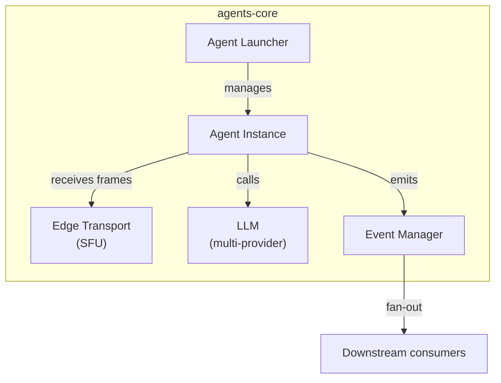
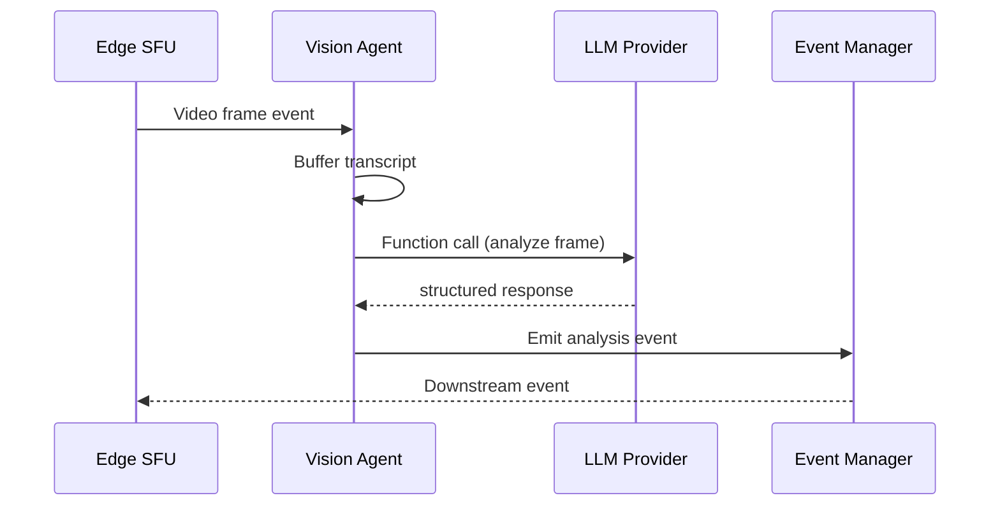
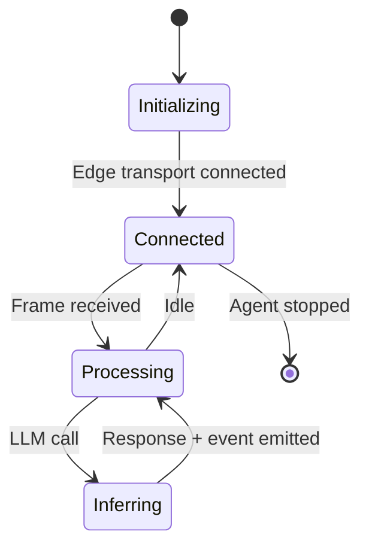

# Vision-Agents — Overview

## What This Is
Vision Agents is a Python framework for building real-time vision-aware AI agents. It provides a core agent runtime, LLM integration, edge transport (SFU/WebRTC-like), and event management for deploying agents that process live video streams.

## Who It's For
AI engineers building real-time video understanding systems — surveillance, robotics, accessibility tools, live event analysis.

## Problem It Solves
Provides the infrastructure layer (agent lifecycle, event routing, LLM function calling, edge transport) so developers can focus on agent logic rather than plumbing.

## How It's Used
Import the agents-core package, define agent types and instructions, connect to an edge transport (SFU), and the framework manages agent lifecycle, LLM calls, transcript buffering, and event fan-out. CI/CD via GitHub Actions with daily runs and full test coverage.

## Component Stack

## Data Flow

## Behavioral Model

---
*Generated by github-repo-overview skill · Last updated: 2026-06-09 · Stack: Python + uv + WebRTC/SFU transport + LLM (multi-provider) + GitHub Actions CI*
